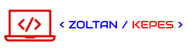

# Zoltan's Website

The site's purpose is to share and showcase my work so I can get feedback and improve my work.

---

_link to "Zoltan's Website" ->_ [zoltan.kepes.com](https://www.zoltankepes.com/)

---

## Table of Content

[1. Features](#1-features)

---

[&#X21e7; back to the "table of content" &#X21e7;](#table-of-content)

## 1. Features

### 1. Pages are automaticly added to the navbar

- if a page (.js) or a directory with pages is added under the project's "**/pages/about**", "**/pages/certificates**", "**/pages/notes**", "**/pages/projects**", "**/pages/apps**" directory, then it will be automatically added to the "website's navbar" as a working link
- project-directories are shown as link-folders in the navbar
- images in the project's "**/public/icons/**" directory with the same **name** as the directories, are added as icon to the link-folder in the website's navbar

_see [auto-page-navbar](./assets/documentation/auto-page-navbar.md) documentation for more details_
