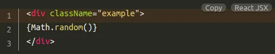
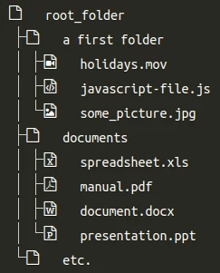
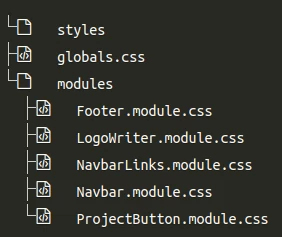

[&#X21e7; back to the "README" &#X21e7;](../../README.md)

# code-block and file-tree documentation

## how to use code-block

- import the `CodeBlock` component
- props:
  - `codeBlock={codeSample}` (**mandatory**)
    - `codeSample` constant as string within "backticks" ` "``" `
  - `language={"language-jsx"}` (**mandatory**) ([prism doc](https://prismjs.com/#supported-languages))
    - `"language-jsx"` the language needs to be specified, see list of supported [languages](https://prismjs.com/#supported-languages), **language-XXXX**
    - **note:** you may need to update the components language imports, _see below for more details_
  - `lineHighlight={"1"}` (**optional**) ([prism doc](https://prismjs.com/plugins/line-highlight/))
    - `"1"` only first line, `"1-3"`line 1 to 3, `"1,4"` line 1 and line 4, `"1-2, 5, 9-20"`lines 1 through 2, line 5, lines 9 through 20
- _example:_

```jsx
import CodeBlock from "../../../components/CodeBlock";

const codeSample = `<div className="example">
{Math.random()}
</div>`;

export default function buttons({}) {
  return (
      <CodeBlock
        codeBlock={codeSample}
        language={"language-jsx"}
        lineHighlight={"1"}
      />
```



- **note:** _you need need to hover over the code block to see the see the "copy" button and the name of the "language"_

### add languages to the component

- open the component `components/CodeBlock.js`
- add the import to the top `import "prismjs/components/prism-jsx.js";`
- check `/node_modules/prismjs/components/`... for the available languages and the [prism documentation](https://prismjs.com/#supported-languages)

### change styles

- original styles are located in plugin specific CSS under `node_modules/prismjs/plugins/`...
- they can be over written with the global style sheet under `styles/globals.css` by targeting the correct class, use browser devtools
- _example:_

```css
.line-highlight {
  background: linear-gradient(
    to right,
    hsla(26, 100%, 51%, 0.1) 90%,
    hsla(24, 82%, 29%, 0.1)
  ) !important;
}

.toolbar-item {
  margin: 0 4px;
}
```

---

## file tree

- displays a file tree

### how to use file tree

- import the `FileTree` component
- props:
  - `treeView={treeView}` (**mandatory**)
    - `treeView` constant as string within "backticks" ` "``" `
- _example:_

```jsx
import FileTree from "../../../components/FileTree";

const treeView = `
root_folder/
├── a first folder/
|   ├── holidays.mov
|   ├── javascript-file.js
|   └── some_picture.jpg
├── documents/
|   ├── spreadsheet.xls
|   ├── manual.pdf
|   ├── document.docx
|   └── presentation.ppt
└── etc.
`;

export default function buttons({}) {
  return <FileTree treeView={treeView} />;
}
```



- _tip:_ use the **CLI** with the `tree` command:
  - copy the output and use it as prop input

```bash
tree /path/to/directory
```

```jsx
const bigTree = `
└── styles
├── globals.css
└── modules
    ├── Footer.module.css
    ├── LogoWriter.module.css
    ├── NavbarLinks.module.css
    ├── Navbar.module.css
    └── ProjectButton.module.css
`;
```


